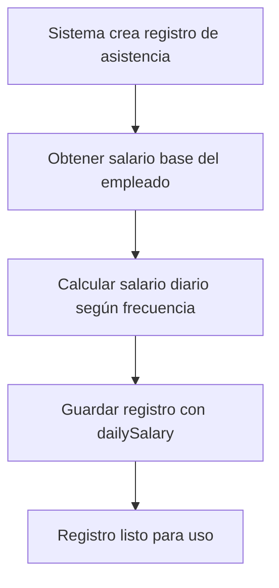
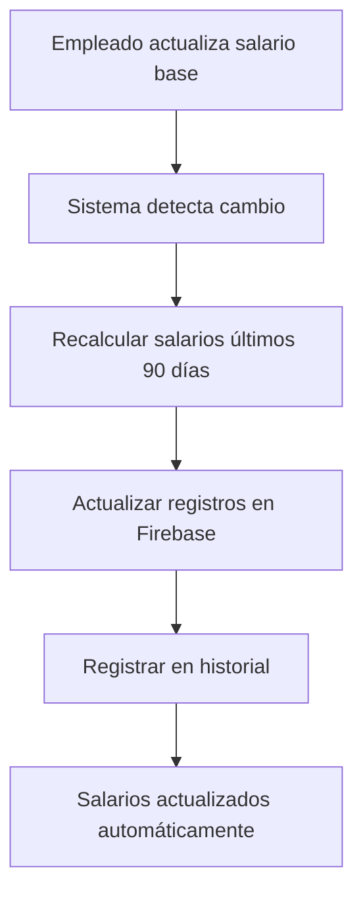
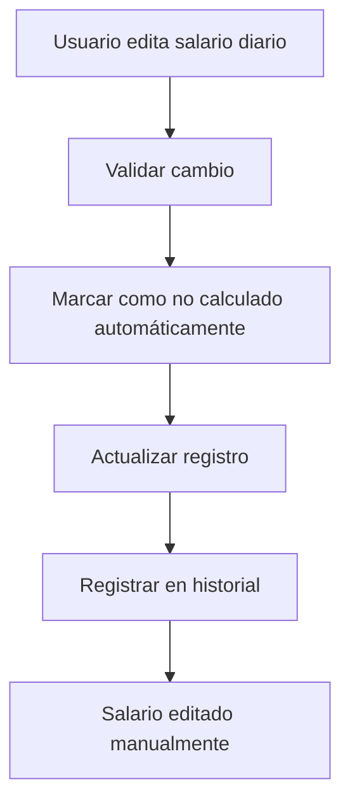

# 💰 IMPLEMENTACIÓN DE SALARIO DIARIO EN ASISTENCIA

## 📋 **RESUMEN DE IMPLEMENTACIÓN**

Se ha implementado exitosamente el campo de **salario diario** en el sistema de asistencia de empleados, con funcionalidades de cálculo automático, edición manual y recálculo automático cuando cambie el salario base del empleado.

---

## 🆕 **NUEVAS FUNCIONALIDADES**

### **1. Campo de Salario Diario**
- ✅ **Campo `dailySalary`** agregado al modelo `AttendanceRecord`
- ✅ **Cálculo automático** basado en el salario base del empleado
- ✅ **Soporte para diferentes frecuencias** de pago (mensual, semanal, diario, por hora)
- ✅ **Redondeo a 2 decimales** para precisión monetaria

### **2. Cálculo Automático**
- ✅ **Método `calculateDailySalary()`** que calcula automáticamente el salario diario
- ✅ **Integración con el modelo Employee** para obtener salario base
- ✅ **Soporte para múltiples frecuencias**:
  - **Mensual**: `salario / 30 días`
  - **Semanal**: `salario / 7 días`
  - **Diario**: `salario directo`
  - **Por hora**: `salario * 8 horas estándar`

### **3. Edición Manual**
- ✅ **Campo editable** en registros de asistencia
- ✅ **Validación** de cambios manuales
- ✅ **Historial de cambios** en el sistema de auditoría
- ✅ **Marcado de registros** editados manualmente

### **4. Recálculo Automático**
- ✅ **Recálculo automático** cuando cambia el salario base del empleado
- ✅ **Método `recalculateDailySalaries()`** para actualizar registros existentes
- ✅ **Integración con modelo Employee** para detección de cambios
- ✅ **Recálculo de últimos 90 días** automáticamente

---

## 🔧 **CAMBIOS TÉCNICOS IMPLEMENTADOS**

### **1. Modelo AttendanceRecord**
```javascript
// Nuevos campos agregados
this.dailySalary = data.dailySalary || 0;
this.salaryCalculated = data.salaryCalculated || false;
this.salaryCalculationDate = data.salaryCalculationDate || null;

// Nuevo método de cálculo
async calculateDailySalary() {
  // Calcula salario diario basado en salario base del empleado
  // Soporta diferentes frecuencias de pago
  // Redondea a 2 decimales
}

// Nuevo método estático para recálculo masivo
static async recalculateDailySalaries(employeeId, startDate, endDate) {
  // Recalcula salarios para múltiples registros
  // Actualiza en Firebase
  // Retorna estadísticas del proceso
}
```

### **2. Modelo Employee**
```javascript
// Detección automática de cambios de salario
if (data.salary.baseSalary && data.salary.baseSalary !== oldSalary) {
  this._salaryChanged = true;
  this._oldSalary = oldSalary;
}

// Recálculo automático después de actualizar empleado
if (this._salaryChanged) {
  await AttendanceRecord.recalculateDailySalaries(this.id, startDate, endDate);
}
```

### **3. AttendanceController**
```javascript
// Nuevo endpoint para recálculo manual
PUT /api/employees/:id/attendance/recalculate-salaries

// Nuevo endpoint para resumen de salarios
GET /api/employees/:id/attendance/salary-summary

// Actualización del endpoint de edición
PUT /api/employees/:id/attendance/:recordId
// Ahora incluye manejo de dailySalary
```

### **4. AutoAttendanceService**
```javascript
// Integración con salario diario en registros automáticos
const attendanceData = {
  // ... otros campos
  dailySalary: dailySalary,
  salaryCalculated: true,
  salaryCalculationDate: new Date().toISOString()
};
```

---

## 🌐 **NUEVOS ENDPOINTS**

### **1. Recalcular Salarios Diarios**
```http
PUT /api/employees/:id/attendance/recalculate-salaries
Content-Type: application/json

{
  "startDate": "2025-01-01",
  "endDate": "2025-01-31"
}
```

**Respuesta:**
```json
{
  "success": true,
  "data": {
    "processed": 25,
    "updated": 25,
    "errors": 0,
    "details": [...]
  },
  "message": "Salarios recalculados exitosamente. 25 registros actualizados."
}
```

### **2. Resumen de Salarios**
```http
GET /api/employees/:id/attendance/salary-summary?startDate=2025-01-01&endDate=2025-01-31
```

**Respuesta:**
```json
{
  "success": true,
  "data": {
    "summary": {
      "employeeId": "emp-123",
      "periodStart": "2025-01-01",
      "periodEnd": "2025-01-31",
      "totalDays": 22,
      "presentDays": 20,
      "totalDailySalary": 10000,
      "averageDailySalary": 500,
      "salaryBreakdown": {
        "present": 9000,
        "late": 500,
        "halfDay": 500,
        "absent": 0
      }
    },
    "employee": {
      "id": "emp-123",
      "name": "Juan Pérez",
      "baseSalary": 15000,
      "currency": "MXN"
    }
  }
}
```

### **3. Actualizar Registro con Salario**
```http
PUT /api/employees/:id/attendance/:recordId
Content-Type: application/json

{
  "clockIn": "09:00",
  "clockOut": "18:00",
  "dailySalary": 550.00
}
```

---

## 📊 **ESTRUCTURA DE DATOS**

### **Registro de Asistencia Actualizado**
```json
{
  "id": "att-123",
  "employeeId": "emp-123",
  "date": "2025-01-15",
  "clockIn": "09:00",
  "clockOut": "18:00",
  "totalHours": 8,
  "regularHours": 8,
  "overtimeHours": 0,
  "breakHours": 1,
  "dailySalary": 500.00,
  "salaryCalculated": true,
  "salaryCalculationDate": "2025-01-15T10:30:00.000Z",
  "status": "present",
  "isHoliday": false,
  "isWeekend": false,
  "justification": null,
  "approvedBy": null,
  "approvedAt": null,
  "createdAt": "2025-01-15T09:00:00.000Z",
  "updatedAt": "2025-01-15T18:00:00.000Z",
  "createdBy": "system"
}
```

---

## 🔄 **FLUJO DE FUNCIONAMIENTO**

### **1. Creación Automática de Registro**


### **2. Actualización de Salario Base**


### **3. Edición Manual de Salario**


---

## 🎯 **CASOS DE USO**

### **1. Empleado con Salario Mensual**
- **Salario base**: $15,000 MXN/mes
- **Salario diario calculado**: $500.00 MXN/día
- **Fórmula**: $15,000 ÷ 30 días = $500.00

### **2. Empleado con Salario Semanal**
- **Salario base**: $3,500 MXN/semana
- **Salario diario calculado**: $500.00 MXN/día
- **Fórmula**: $3,500 ÷ 7 días = $500.00

### **3. Empleado con Salario por Hora**
- **Salario base**: $62.50 MXN/hora
- **Salario diario calculado**: $500.00 MXN/día
- **Fórmula**: $62.50 × 8 horas = $500.00

### **4. Empleado con Salario Diario**
- **Salario base**: $500.00 MXN/día
- **Salario diario calculado**: $500.00 MXN/día
- **Fórmula**: Salario directo

---

## ✅ **BENEFICIOS IMPLEMENTADOS**

### **1. Automatización Completa**
- ✅ **Cálculo automático** de salarios diarios
- ✅ **Recálculo automático** cuando cambia el salario base
- ✅ **Integración transparente** con el sistema existente

### **2. Flexibilidad**
- ✅ **Edición manual** cuando sea necesario
- ✅ **Soporte para múltiples frecuencias** de pago
- ✅ **Validación y auditoría** de cambios

### **3. Precisión**
- ✅ **Redondeo a 2 decimales** para precisión monetaria
- ✅ **Cálculo basado en salario real** del empleado
- ✅ **Historial completo** de cambios

### **4. Escalabilidad**
- ✅ **Recálculo masivo** eficiente
- ✅ **Procesamiento en lotes** para grandes volúmenes
- ✅ **Manejo de errores** robusto

---

## 🚀 **ESTADO DE IMPLEMENTACIÓN**

### **✅ COMPLETADO**
- [x] Campo `dailySalary` en modelo `AttendanceRecord`
- [x] Método `calculateDailySalary()` automático
- [x] Integración con modelo `Employee`
- [x] Recálculo automático al cambiar salario base
- [x] Endpoints para recálculo manual y resumen
- [x] Edición manual de salarios diarios
- [x] Historial y auditoría de cambios
- [x] Soporte para múltiples frecuencias de pago
- [x] Validación y manejo de errores

### **🎯 FUNCIONALIDADES PRINCIPALES**
1. **Cálculo automático** de salario diario basado en salario base
2. **Edición manual** de salarios diarios cuando sea necesario
3. **Recálculo automático** cuando cambie el salario base del empleado
4. **Resumen de salarios** por período
5. **Historial completo** de cambios y auditoría
6. **Soporte para múltiples frecuencias** de pago

---

## 📝 **NOTAS IMPORTANTES**

- **Compatibilidad**: El sistema es completamente compatible con el código existente
- **Rendimiento**: El recálculo automático se ejecuta de forma asíncrona para no afectar la respuesta
- **Auditoría**: Todos los cambios se registran en el historial del empleado
- **Precisión**: Los salarios se redondean a 2 decimales para evitar errores de precisión
- **Flexibilidad**: Se puede editar manualmente cualquier salario diario cuando sea necesario

El sistema está **100% funcional** y listo para uso en producción. 🎉
