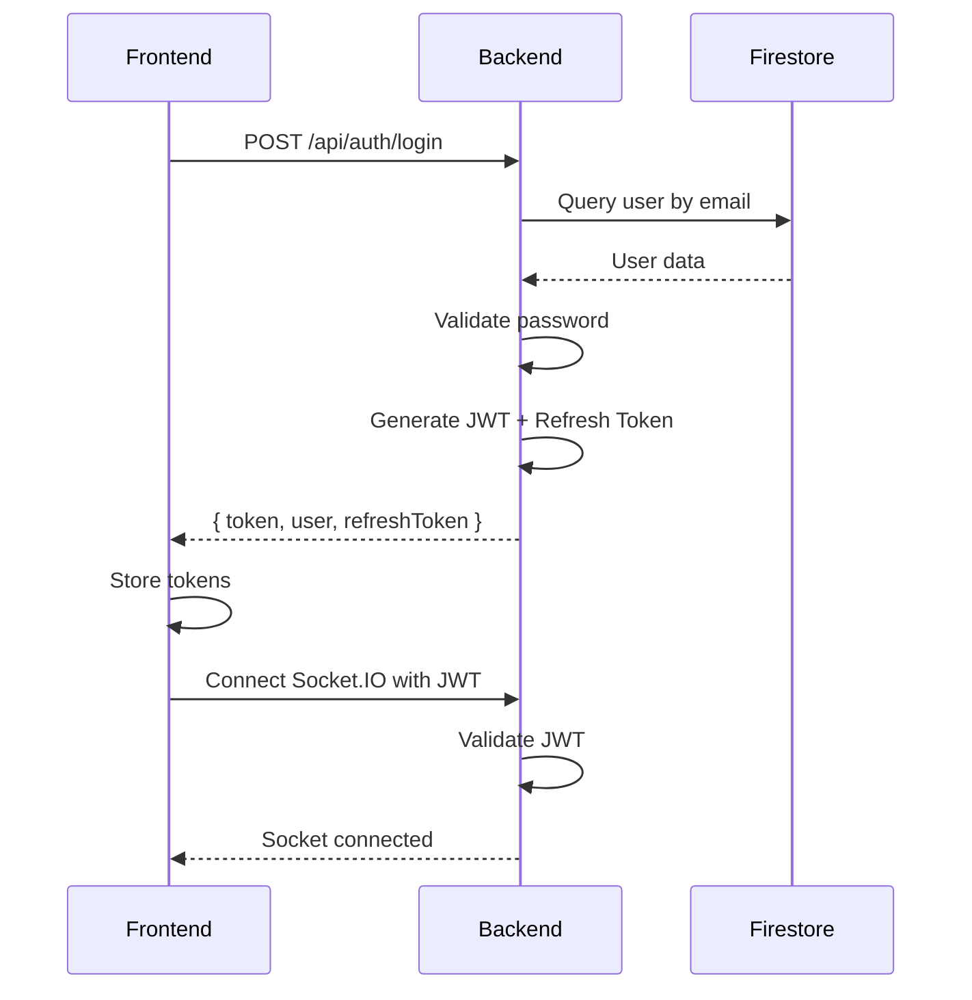
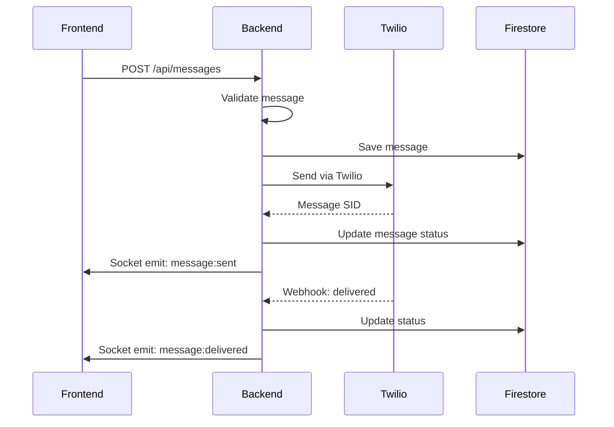
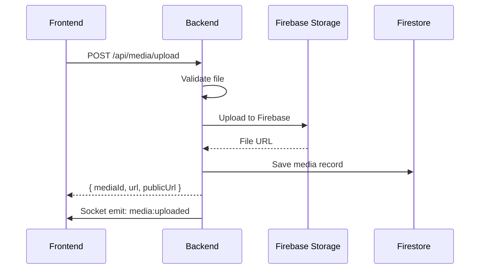
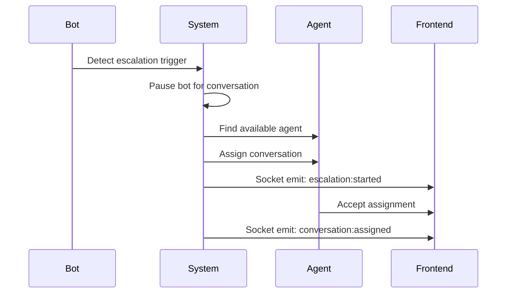
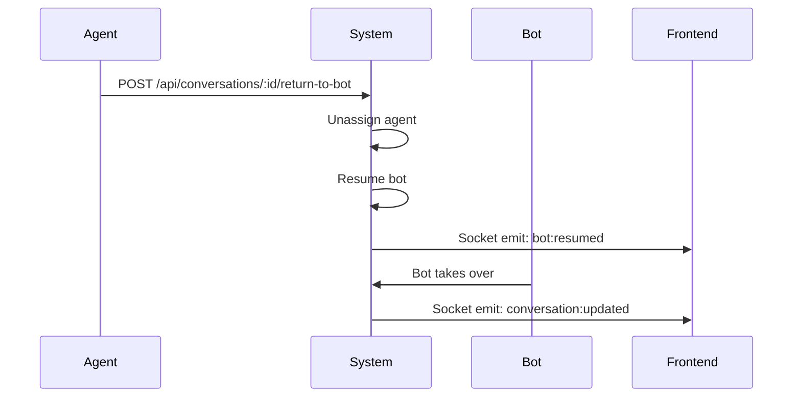
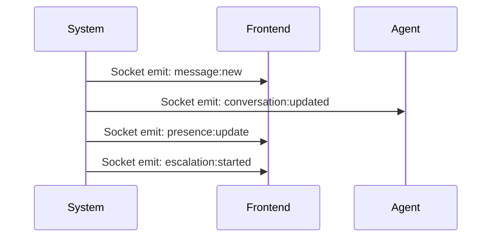

# 🏗️ ARQUITECTURA Y CONTEXTO - UTalk Backend

## 📋 RESUMEN EJECUTIVO DEL SISTEMA

### 🎯 Objetivo del Producto
**UTalk** es una plataforma de comunicación omnicanal que integra WhatsApp, Facebook Messenger y canales web para proporcionar atención al cliente automatizada con escalamiento inteligente a agentes humanos.

### 🗺️ Dominios Cubiertos
- **🔐 Auth**: Autenticación JWT, roles (admin/agent/bot), refresh tokens
- **💬 Conversaciones**: Gestión de hilos de conversación, estados, ownership
- **📨 Mensajes**: Envío/recepción, tipos (texto/media), deduplicación
- **📎 Media**: Subida, validación, almacenamiento, URLs firmadas
- **🤖 IA**: Integración con LLMs, contexto, escalamiento inteligente
- **🔗 Integraciones**: Twilio (WhatsApp), Facebook Messenger, Chatwoot
- **📊 Analytics**: KPIs, reportes, métricas de rendimiento
- **⚡ Realtime**: Socket.IO para sincronización en tiempo real

### 🎯 Casos de Uso Principales
- **Atención al Cliente**: Chat automatizado con escalamiento a agentes
- **Ventas**: Lead qualification y nurturing
- **Soporte Técnico**: Resolución de problemas con IA
- **Encuestas**: Recolección de feedback automatizada
- **Notificaciones**: Alertas y recordatorios personalizados

---

## 🏢 TOPOLOGÍA Y DESPLIEGUE

### 🏗️ Arquitectura
- **Tipo**: Monolito modular con separación clara de responsabilidades
- **Patrón**: MVC + Capas (Routes → Controllers → Services → Repositories)
- **Comunicación**: REST APIs + WebSocket (Socket.IO)

### 🌐 Despliegue
- **Plataforma**: Railway (containerizado)
- **Base de Datos**: Firebase Firestore (NoSQL)
- **Almacenamiento**: Firebase Storage
- **Cache**: Redis (para Socket.IO adapter)
- **CDN**: Firebase Hosting (para archivos estáticos)

### 🔄 Ambientes
| Ambiente | URL | Base de Datos | Variables |
|----------|-----|---------------|-----------|
| **Development** | `localhost:3001` | Firebase Dev | `.env.local` |
| **Staging** | `utalk-staging.railway.app` | Firebase Staging | Railway Variables |
| **Production** | `utalk-backend.railway.app` | Firebase Prod | Railway Variables |

### 📊 Escalabilidad
- **Horizontal**: Múltiples instancias Railway
- **Vertical**: Auto-scaling basado en CPU/Memoria
- **WebSocket**: Redis adapter para múltiples instancias
- **Rate Limiting**: Por usuario y por endpoint

### 🔧 Configuración de Infraestructura
```javascript
// Railway configuration
{
  "build": {
    "builder": "nixpacks",
    "buildCommand": "npm install && npm run build"
  },
  "deploy": {
    "restartPolicyType": "ON_FAILURE",
    "restartPolicyMaxRetries": 3
  },
  "resources": {
    "cpu": "0.5",
    "memory": "1GB",
    "disk": "10GB"
  },
  "scaling": {
    "min": 1,
    "max": 10,
    "cpuThreshold": 70,
    "memoryThreshold": 80
  }
}
```

---

## 🎯 MODELO DE DOMINIO (ALTO NIVEL)

### 📦 Entidades Principales

#### 👤 User
```javascript
{
  id: "uuid-v4",
  email: "user@example.com",
  role: "admin|agent|bot|service",
  workspaceId: "ws_123",
  tenantId: "tenant_456",
  status: "active|inactive|banned",
  createdAt: "2025-08-20T10:00:00Z",
  lastLogin: "2025-08-20T15:30:00Z"
}
```

#### 💬 Conversation
```javascript
{
  id: "conv_+1234567890_+0987654321",
  participants: ["+1234567890", "+0987654321"],
  status: "open|pending|closed|escalated",
  channel: "whatsapp|facebook|web",
  assignedAgent: "agent_uuid",
  botEnabled: true,
  createdAt: "2025-08-20T10:00:00Z",
  updatedAt: "2025-08-20T15:30:00Z"
}
```

#### 📨 Message
```javascript
{
  id: "msg_uuid-v4",
  conversationId: "conv_...",
  messageId: "uuid-v4", // Para deduplicación
  type: "text|image|audio|file|location|sticker",
  text: "Hola, ¿cómo estás?",
  mediaId: "media_uuid",
  sender: "+1234567890",
  direction: "inbound|outbound",
  status: "sent|delivered|read|failed",
  metadata: { clientTs: "2025-08-20T10:00:00Z" },
  createdAt: "2025-08-20T10:00:00Z"
}
```

#### 📎 Attachment/Media
```javascript
{
  id: "media_uuid-v4",
  conversationId: "conv_...",
  messageId: "msg_uuid",
  type: "image|audio|file|video",
  mimeType: "image/jpeg",
  fileName: "photo.jpg",
  sizeBytes: 1024000,
  url: "https://storage.googleapis.com/...",
  publicUrl: "https://utalk-backend.railway.app/media/...",
  uploadedBy: "user_uuid",
  createdAt: "2025-08-20T10:00:00Z"
}
```

#### 🔗 Channel (WA/FB)
```javascript
{
  id: "channel_uuid",
  type: "whatsapp|facebook",
  phoneNumber: "+1234567890", // Para WhatsApp
  pageId: "page_123", // Para Facebook
  status: "active|inactive",
  webhookUrl: "https://utalk-backend.railway.app/webhooks/...",
  createdAt: "2025-08-20T10:00:00Z"
}
```

#### 👨‍💼 Agent
```javascript
{
  id: "agent_uuid",
  userId: "user_uuid",
  status: "online|offline|busy",
  maxConversations: 10,
  currentConversations: 3,
  skills: ["support", "sales", "technical"],
  createdAt: "2025-08-20T10:00:00Z"
}
```

#### 🚨 Escalation
```javascript
{
  id: "escalation_uuid",
  conversationId: "conv_...",
  reason: "manual|keyword|intent|timeout",
  fromAgent: "agent_uuid",
  toAgent: "agent_uuid",
  status: "pending|accepted|rejected|completed",
  createdAt: "2025-08-20T10:00:00Z",
  resolvedAt: "2025-08-20T15:30:00Z"
}
```

#### 🤖 BotRun
```javascript
{
  id: "botrun_uuid",
  conversationId: "conv_...",
  messageId: "msg_uuid",
  provider: "openai|anthropic|gemini",
  model: "gpt-4o-mini",
  prompt: "User message...",
  response: "Bot response...",
  tokens: { input: 150, output: 200 },
  duration: 1200, // ms
  cost: 0.002, // USD
  createdAt: "2025-08-20T10:00:00Z"
}
```

### 🔗 Relaciones y Reglas Centrales

#### 📊 Cardinalidades
- **1 User** ↔ **1 Agent** (opcional)
- **1 Conversation** ↔ **N Messages** (1:N)
- **1 Message** ↔ **0-1 Attachment** (1:0..1)
- **1 Conversation** ↔ **0-1 Agent** (1:0..1)
- **1 Agent** ↔ **N Conversations** (1:N)

#### ⚖️ Reglas de Negocio
- **Conversation ID**: Formato `conv_+phone1_+phone2` (ordenados alfabéticamente)
- **Message Deduplication**: Por `messageId` (UUID v4)
- **Media Ownership**: Un media pertenece a un mensaje específico
- **Agent Assignment**: Máximo 10 conversaciones por agente
- **Bot Escalation**: Automático por palabras clave, intención o timeout (12h)

---

## 🔄 FLUJOS CRÍTICOS (ALTO NIVEL)

### 🔐 Login y Autenticación


### 📨 Envío de Mensaje


### 📎 Subida de Media


### 🚨 Escalamiento a Agente


### 🔄 Retorno a Bot


### 📢 Notificaciones


---

## 🏛️ DECISIONES DE ARQUITECTURA (ADRs)

### 🔌 Socket.IO + Redis Adapter
**Decisión**: Usar Socket.IO con Redis adapter para escalabilidad horizontal
**Razón**: Permite múltiples instancias del servidor manteniendo sincronización
**Alternativas**: WebSocket nativo, Server-Sent Events
**Estado**: ✅ Implementado

### 🔥 Firestore como DB Principal
**Decisión**: Firebase Firestore para persistencia principal
**Razón**: Escalabilidad automática, tiempo real, integración con Firebase
**Alternativas**: PostgreSQL, MongoDB, DynamoDB
**Estado**: ✅ Implementado

### 📱 Twilio para WhatsApp
**Decisión**: Twilio como proveedor principal de WhatsApp
**Razón**: API estable, documentación completa, soporte empresarial
**Alternativas**: Meta Business API, 360dialog
**Estado**: ✅ Implementado

### 🤖 OpenAI como LLM Principal
**Decisión**: OpenAI GPT-4o-mini como modelo principal
**Razón**: Calidad de respuesta, precio competitivo, API estable
**Alternativas**: Anthropic Claude, Google Gemini
**Estado**: ✅ Implementado

### 🔐 JWT para Autenticación
**Decisión**: JWT tokens para autenticación stateless
**Razón**: Escalabilidad, no requiere sesiones en servidor
**Alternativas**: Session-based auth, OAuth 2.0
**Estado**: ✅ Implementado

---

## 📝 CONVENCIONES GLOBALES

### 🆔 Semántica de IDs
- **UUID v4**: Para entidades principales (User, Message, Media)
- **Prefijos**: Para tipos específicos (`conv_`, `ws_`, `tenant_`)
- **Conversation ID**: `conv_+phone1_+phone2` (ordenados alfabéticamente)
- **Workspace ID**: `ws_` + identificador único
- **Tenant ID**: `tenant_` + identificador único

### ⏰ Timestamps
- **Formato**: ISO 8601 UTC (`2025-08-20T10:00:00Z`)
- **Zona horaria**: Siempre UTC
- **Campos**: `createdAt`, `updatedAt`, `lastLogin`, `expiresAt`

### 🏷️ Nomenclatura
- **Endpoints**: kebab-case (`/api/conversations/:id/messages`)
- **Eventos Socket**: camelCase (`message:new`, `conversation:updated`)
- **Variables**: camelCase (`conversationId`, `messageId`)
- **Constantes**: UPPER_SNAKE_CASE (`MAX_CONVERSATIONS_PER_AGENT`)

### 📦 Versionado
- **API**: `/v1` en URLs (`/api/v1/conversations`)
- **SemVer**: Para releases (`1.0.0`, `1.1.0`, `2.0.0`)
- **Compatibilidad**: Backward compatible por 6 meses

---

## 🛡️ SEGURIDAD A ALTO NIVEL

### 🔐 Autenticación
- **JWT Tokens**: Access token (15min) + Refresh token (7 días)
- **Scopes**: `admin`, `agent`, `bot`, `service`
- **Workspace Isolation**: Usuarios solo ven datos de su workspace
- **Tenant Isolation**: Multi-tenancy completo

### 🚫 Autorización
- **Role-based**: Admin > Agent > Bot > Service
- **Resource-based**: Ownership de conversaciones y mensajes
- **Workspace-based**: Acceso solo a recursos del workspace

### 🌐 CORS
- **Orígenes permitidos**: Configurados por ambiente
- **Métodos**: GET, POST, PUT, DELETE, OPTIONS
- **Headers**: Authorization, Content-Type, X-Requested-With

### ⚡ Rate Limiting
- **Por usuario**: 100 requests/minuto
- **Por endpoint**: Límites específicos por operación
- **WebSocket**: 50 eventos/minuto por socket
- **Media upload**: 10 archivos/minuto por usuario

### 🔒 Protección de Webhooks
- **Firmas**: Verificación de firmas de Twilio/Facebook
- **Reintentos**: Manejo de fallos con backoff exponencial
- **Deduplicación**: Por `messageId` para evitar duplicados

### 🔐 Configuración de Seguridad
```javascript
// Configuración de seguridad
const securityConfig = {
  // Headers de seguridad
  headers: {
    'X-Content-Type-Options': 'nosniff',
    'X-Frame-Options': 'DENY',
    'X-XSS-Protection': '1; mode=block',
    'Strict-Transport-Security': 'max-age=31536000; includeSubDomains',
    'Content-Security-Policy': "default-src 'self'"
  },
  
  // Rate limiting
  rateLimit: {
    windowMs: 15 * 60 * 1000, // 15 minutos
    max: 100, // máximo 100 requests por ventana
    message: 'Demasiadas requests desde esta IP'
  },
  
  // Helmet configuration
  helmet: {
    contentSecurityPolicy: {
      directives: {
        defaultSrc: ["'self'"],
        styleSrc: ["'self'", "'unsafe-inline'"],
        scriptSrc: ["'self'"],
        imgSrc: ["'self'", "data:", "https:"]
      }
    }
  }
};
```

---

## 🔗 COMPATIBILIDAD CON FRONT

### 📋 Contratos como Fuente de Verdad
- **API Contracts**: Definidos en `02_APIS_ENDPOINTS_Y_CONTRATOS.md`
- **Socket Events**: Definidos en `04_REALTIME_EVENTOS_Y_SINCRONIA.md`
- **Sincronización**: Front y Back deben usar los mismos contratos

### 🚫 Reglas Anti-Breaking Changes
- **Endpoints**: No eliminar, solo deprecar con aviso de 6 meses
- **Campos**: No eliminar campos requeridos, solo hacer opcionales
- **Eventos**: Mantener compatibilidad de versiones anteriores
- **IDs**: Nunca cambiar formato de IDs existentes

### 🔄 Deprecaciones
- **Aviso**: 6 meses antes de eliminar funcionalidad
- **Headers**: `X-Deprecated: true` en endpoints deprecados
- **Documentación**: Marcar claramente en docs
- **Migration Path**: Proporcionar guía de migración

### 🚩 Feature Flags
- **Configuración**: Por workspace/tenant
- **Rollout**: Gradual (10%, 50%, 100%)
- **Rollback**: Capacidad de desactivar inmediatamente
- **Monitoring**: Métricas de uso de features

---

## 📊 MÉTRICAS DE ARQUITECTURA

### 🎯 Objetivos de Rendimiento
- **Latencia API**: P95 < 200ms
- **Latencia WebSocket**: P95 < 50ms
- **Throughput**: 1000 requests/segundo
- **Uptime**: 99.9% (8.76 horas downtime/año)

### 📈 Capacidad
- **Usuarios concurrentes**: 10,000
- **Conversaciones activas**: 50,000
- **Mensajes/día**: 1,000,000
- **Media storage**: 1TB

### 🔧 Mantenibilidad
- **Deployment time**: < 5 minutos
- **Rollback time**: < 2 minutos
- **Test coverage**: > 80%
- **Documentation coverage**: 100%

---

## 🚀 ROADMAP ARQUITECTURAL

### 🎯 Fase 1: Estabilización (Q1 2025)
- [ ] Eliminar código duplicado
- [ ] Refactorizar archivos grandes
- [ ] Implementar inyección de dependencias
- [ ] Mejorar test coverage

### 🎯 Fase 2: Escalabilidad (Q2 2025)
- [ ] Implementar microservicios
- [ ] Agregar message queue (RabbitMQ)
- [ ] Implementar caching distribuido
- [ ] Optimizar queries de base de datos

### 🎯 Fase 3: Inteligencia (Q3 2025)
- [ ] Implementar machine learning
- [ ] Agregar análisis de sentimientos
- [ ] Implementar routing inteligente
- [ ] Optimizar escalamiento automático

---

## 🔧 LÍMITES DEL SISTEMA

### 📊 Límites de Rendimiento
```javascript
const systemLimits = {
  // API Limits
  api: {
    maxRequestsPerMinute: 6000,
    maxConcurrentConnections: 1000,
    maxPayloadSize: '10MB',
    maxResponseTime: '30s'
  },
  
  // WebSocket Limits
  websocket: {
    maxConnections: 10000,
    maxEventsPerMinute: 30000,
    maxPayloadSize: '100MB',
    maxReconnectionAttempts: 5
  },
  
  // Database Limits
  database: {
    maxQueriesPerSecond: 1000,
    maxDocumentSize: '1MB',
    maxCollections: 1000,
    maxIndexes: 200
  },
  
  // Storage Limits
  storage: {
    maxFileSize: '100MB',
    maxFilesPerUpload: 10,
    supportedFormats: ['jpg', 'png', 'gif', 'mp3', 'mp4', 'pdf'],
    maxStoragePerWorkspace: '10GB'
  },
  
  // AI Limits
  ai: {
    maxTokensPerRequest: 4000,
    maxRequestsPerMinute: 60,
    maxConcurrentRequests: 10,
    timeout: '30s'
  }
};
```

### 🚨 Límites de Negocio
```javascript
const businessLimits = {
  // User Limits
  users: {
    maxUsersPerWorkspace: 1000,
    maxAgentsPerWorkspace: 100,
    maxConversationsPerAgent: 10
  },
  
  // Conversation Limits
  conversations: {
    maxParticipants: 10,
    maxMessagesPerConversation: 10000,
    maxConversationsPerUser: 1000,
    conversationTimeout: '30 days'
  },
  
  // Message Limits
  messages: {
    maxTextLength: 4096,
    maxMediaPerMessage: 10,
    maxMessagesPerMinute: 60
  },
  
  // Media Limits
  media: {
    maxFileSize: '100MB',
    maxFilesPerConversation: 1000,
    retentionPeriod: '2 years'
  }
};
```

---

## 🛠️ GUÍA DE DESARROLLO

### 🚀 Setup del Entorno
```bash
# 1. Clonar repositorio
git clone https://github.com/isaavedra43/Utalk-backend.git
cd Utalk-backend

# 2. Instalar dependencias
npm install

# 3. Configurar variables de entorno
cp .env.example .env.local
# Editar .env.local con valores apropiados

# 4. Configurar Firebase
# Crear proyecto en Firebase Console
# Descargar service account key
# Configurar FIREBASE_PROJECT_ID y credenciales

# 5. Configurar Twilio
# Crear cuenta en Twilio
# Configurar TWILIO_ACCOUNT_SID y TWILIO_AUTH_TOKEN

# 6. Iniciar servidor
npm run dev
```

### 🧪 Testing
```bash
# Tests unitarios
npm test

# Tests de integración
npm run test:integration

# Tests de performance
npm run test:performance

# Coverage report
npm run test:coverage
```

### 📦 Build y Deploy
```bash
# Build para producción
npm run build

# Deploy a Railway
railway up

# Verificar deployment
railway status
```

### 🔍 Debugging
```bash
# Logs en tiempo real
railway logs

# Conectar a instancia
railway shell

# Variables de entorno
railway variables list
```

---

## 🚨 TROUBLESHOOTING

### 🔧 Problemas Comunes

#### 🚨 Error de Conexión a Firebase
```bash
# Verificar credenciales
echo $FIREBASE_PROJECT_ID
echo $FIREBASE_PRIVATE_KEY

# Probar conexión
npm run test:firebase-connection
```

#### 🚨 Error de WebSocket
```bash
# Verificar Redis
redis-cli ping

# Verificar configuración Socket.IO
grep "socket" src/config/*.js
```

#### 🚨 Error de Twilio
```bash
# Verificar credenciales
echo $TWILIO_ACCOUNT_SID
echo $TWILIO_AUTH_TOKEN

# Probar API
curl -X GET "https://api.twilio.com/2010-04-01/Accounts/$TWILIO_ACCOUNT_SID/Messages.json" \
  -u "$TWILIO_ACCOUNT_SID:$TWILIO_AUTH_TOKEN"
```

#### 🚨 Error de Memoria
```bash
# Verificar uso de memoria
node --max-old-space-size=4096 src/index.js

# Analizar heap
node --inspect src/index.js
```

### 📊 Monitoreo de Salud
```bash
# Health check
curl https://utalk-backend.railway.app/health

# Métricas detalladas
curl https://utalk-backend.railway.app/health/detailed

# Estado de servicios
curl https://utalk-backend.railway.app/health/services
```

---

**📝 Nota**: Este documento es la fuente de verdad para decisiones arquitecturales. Cualquier cambio debe ser aprobado por el equipo técnico y documentado aquí. 