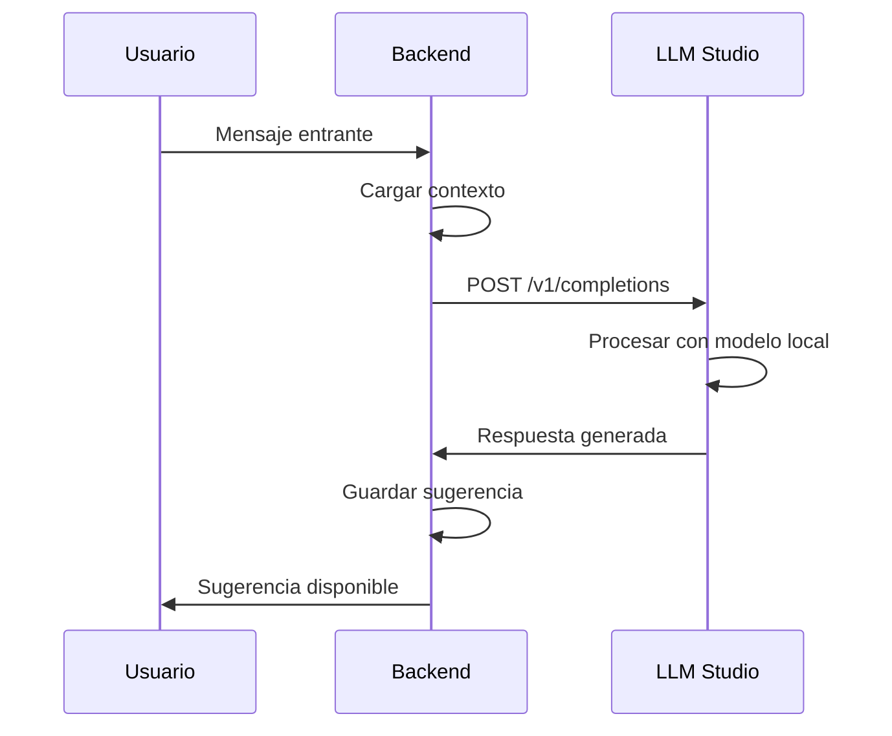

# 🏠 INTEGRACIÓN CON LLM STUDIO

> **Guía completa para conectar LLM Studio local con UTalk Backend**  
> **Versión**: 1.0.0  
> **Fecha**: 2025-08-20

## 📋 Descripción

Esta guía explica cómo integrar **LLM Studio** (ejecutándose en una PC local) con el backend de UTalk que corre en Railway. LLM Studio permite ejecutar modelos de lenguaje localmente, reduciendo costos y mejorando la privacidad.

## 🎯 Beneficios de LLM Studio

- **💰 Costo Cero**: No hay costos por tokens
- **🔒 Privacidad Total**: Los datos nunca salen de tu red local
- **⚡ Baja Latencia**: Respuestas más rápidas para usuarios locales
- **🎛️ Control Total**: Configuración completa de modelos
- **📊 Sin Límites**: Sin restricciones de rate limiting externo

## 🏗️ Arquitectura de Integración

```
┌─────────────────┐    HTTP/API    ┌─────────────────┐
│   UTalk Backend │ ◄────────────► │   LLM Studio    │
│   (Railway)     │                │   (PC Local)    │
└─────────────────┘                └─────────────────┘
         │                                   │
         │                                   │
    ┌────▼────┐                        ┌────▼────┐
    │ Firebase│                        │ Modelos │
    │   DB    │                        │ Locales │
    └─────────┘                        └─────────┘
```

## 🔧 Configuración de LLM Studio

### 1. Instalación y Configuración

```bash
# 1. Descargar e instalar LLM Studio
# Visita: https://lmstudio.ai/

# 2. Abrir LLM Studio y configurar API
# Settings > API > Enable API Server
# Puerto: 3001 (o el que prefieras)
# Habilitar CORS si es necesario

# 3. Descargar modelos
# - gpt-oss-20b (recomendado)
# - llama-3.1-8b
# - mistral-7b
# - codellama-7b
```

### 2. Configuración de Red

```bash
# Obtener IP de tu PC local
ifconfig  # macOS/Linux
ipconfig  # Windows

# Ejemplo: 192.168.1.100
# URL completa: http://192.168.1.100:3001
```

### 3. Verificar Funcionamiento

```bash
# Probar conexión básica
curl http://192.168.1.100:3001

# Probar generación de texto
curl -X POST http://192.168.1.100:3001/v1/completions \
  -H "Content-Type: application/json" \
  -d '{
    "model": "gpt-oss-20b",
    "prompt": "Hola, ¿cómo estás?",
    "max_tokens": 50
  }'
```

## ⚙️ Configuración en UTalk Backend

### 1. Variables de Entorno

```bash
# En Railway o .env
LLM_STUDIO_ENABLED=true
LLM_STUDIO_URL=http://192.168.1.100:3001
```

### 2. Configuración por Workspace

```javascript
// Ejemplo de configuración IA para workspace
{
  "ai_enabled": true,
  "provider": "llm_studio",
  "defaultModel": "gpt-oss-20b",
  "temperature": 0.3,
  "maxTokens": 150,
  "flags": {
    "suggestions": true,
    "rag": false,
    "provider_ready": true
  }
}
```

### 3. Probar Conexión

```bash
# Ejecutar script de prueba
node scripts/test-llm-studio-connection.js
```

## 🔄 Flujo de Integración

### 1. Generación de Sugerencias



### 2. Configuración Automática

```javascript
// El sistema automáticamente:
// 1. Detecta si LLM Studio está disponible
// 2. Usa LLM Studio como proveedor principal
// 3. Fallback a OpenAI si LLM Studio falla
// 4. Aplica rate limiting y circuit breaker
```

## 📊 Monitoreo y Métricas

### 1. Health Checks

```bash
# Verificar estado de LLM Studio
GET /api/ai/health

# Respuesta esperada:
{
  "llm_studio": {
    "status": "healthy",
    "version": "0.2.0",
    "models": ["gpt-oss-20b", "llama-3.1-8b"]
  }
}
```

### 2. Métricas de Uso

```javascript
// Métricas disponibles:
{
  "provider": "llm_studio",
  "circuitBreaker": {
    "isOpen": false,
    "successRate": "95.2",
    "totalRequests": 150
  },
  "config": {
    "baseURL": "http://192.168.1.100:3001",
    "timeout": 10000,
    "rateLimitPerMinute": 10
  }
}
```

## 🚨 Troubleshooting

### Problemas Comunes

#### 1. Error de Conexión
```bash
# Error: ECONNREFUSED
# Solución: Verificar que LLM Studio esté ejecutándose
```

#### 2. Timeout en Respuestas
```bash
# Error: ECONNABORTED
# Solución: Aumentar timeout en configuración
# Los modelos locales pueden tardar 10-30 segundos
```

#### 3. Modelo No Encontrado
```bash
# Error: Model not found
# Solución: Verificar que el modelo esté descargado en LLM Studio
```

### Logs de Debug

```bash
# Habilitar logs detallados
DEBUG=llm_studio:* npm start

# Ver logs en tiempo real
tail -f logs/app.log | grep "LLM Studio"
```

## 🔒 Seguridad

### 1. Configuración de Red

```bash
# Recomendaciones de seguridad:
# - Usar red local privada
# - Configurar firewall si es necesario
# - No exponer LLM Studio a internet
```

### 2. Autenticación

```javascript
// LLM Studio no requiere API key por defecto
// Para mayor seguridad, configurar autenticación básica:
{
  "auth": {
    "type": "basic",
    "username": "admin",
    "password": "secure_password"
  }
}
```

## 📈 Optimización

### 1. Configuración de Modelos

```javascript
// Configuración optimizada para diferentes casos:
{
  "suggestions": {
    "model": "gpt-oss-20b",
    "temperature": 0.3,
    "maxTokens": 150
  },
  "reports": {
    "model": "llama-3.1-8b",
    "temperature": 0.1,
    "maxTokens": 500
  }
}
```

### 2. Rate Limiting

```javascript
// Configuración de rate limiting:
{
  "rateLimitPerMinute": 10,  // Para modelos locales
  "burst": 5,                // Requests en burst
  "timeout": 30000           // 30 segundos para modelos locales
}
```

## 🔄 Migración desde OpenAI

### 1. Configuración Gradual

```javascript
// Estrategia de migración:
// 1. Habilitar LLM Studio como fallback
// 2. Monitorear rendimiento
// 3. Cambiar a LLM Studio como principal
// 4. Mantener OpenAI como backup
```

### 2. Comparación de Costos

```bash
# OpenAI GPT-4o-mini:
# - Entrada: $0.15 por 1M tokens
# - Salida: $0.60 por 1M tokens

# LLM Studio:
# - Costo: $0 (solo electricidad)
# - Hardware: GPU recomendada
```

## 📚 Recursos Adicionales

### 1. Documentación Oficial
- [LLM Studio Documentation](https://lmstudio.ai/docs)
- [API Reference](https://lmstudio.ai/docs/api)

### 2. Modelos Recomendados
- **gpt-oss-20b**: Mejor calidad general
- **llama-3.1-8b**: Buen balance calidad/velocidad
- **mistral-7b**: Excelente para español
- **codellama-7b**: Especializado en código

### 3. Hardware Recomendado
- **GPU**: NVIDIA RTX 3060 o superior
- **RAM**: 16GB mínimo, 32GB recomendado
- **Storage**: SSD para mejor rendimiento

## 🎯 Próximos Pasos

1. **Configurar LLM Studio** en tu PC local
2. **Probar conexión** con el script de prueba
3. **Configurar variables de entorno** en Railway
4. **Habilitar LLM Studio** en un workspace de prueba
5. **Monitorear rendimiento** y ajustar configuración
6. **Migrar gradualmente** desde OpenAI

---

**¿Necesitas ayuda?** Revisa los logs del sistema o contacta al equipo de desarrollo. 