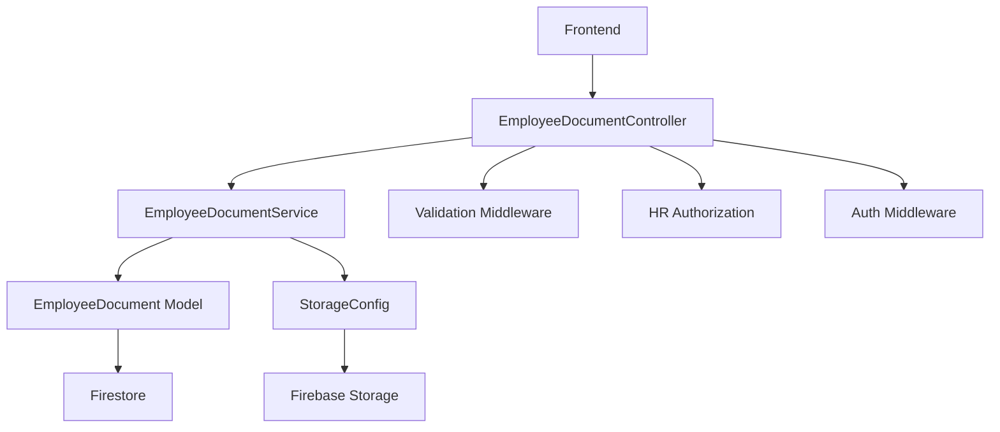

# 📄 MÓDULO DE DOCUMENTOS DE EMPLEADOS

## 🎯 VISIÓN GENERAL

El módulo de documentos de empleados permite gestionar archivos asociados a empleados con funcionalidades avanzadas de versionado, categorización, permisos de confidencialidad y auditoría completa.

## 🏗️ ARQUITECTURA

### **Componentes Principales**

```
src/
├── models/
│   └── EmployeeDocument.js          # Modelo de datos
├── services/
│   └── EmployeeDocumentService.js   # Lógica de negocio
├── controllers/
│   └── EmployeeDocumentController.js # Controladores REST
├── routes/
│   └── employee-documents.js        # Configuración de rutas
├── middleware/
│   └── validation.js                # Validaciones específicas
└── config/
    └── storage.js                   # Configuración de almacenamiento
```

### **Flujo de Datos**



## 📊 MODELO DE DATOS

### **EmployeeDocument**

```javascript
{
  id: string,                    // UUID único
  employeeId: string,            // Referencia al empleado
  originalName: string,          // Nombre original del archivo
  fileSize: number,              // Tamaño en bytes
  mimeType: string,              // Tipo MIME
  category: string,              // Categoría del documento
  description?: string,          // Descripción opcional
  tags: string[],                // Array de tags
  isConfidential: boolean,       // Si es confidencial
  version: number,               // Versión del documento
  uploadedAt: string,            // Timestamp de subida
  expiresAt?: string,            // Fecha de expiración
  storage: {                     // Información de almacenamiento
    provider: string,
    path: string
  },
  checksum: string,              // SHA256 del archivo
  uploader: {                    // Usuario que subió
    id: string,
    email: string,
    name?: string
  },
  audit: {                       // Información de auditoría
    createdBy: string,
    createdAt: string,
    deletedAt?: string,
    deletedBy?: string
  }
}
```

### **Categorías de Documentos**

- `contract`: Contratos laborales
- `id`: Documentos de identificación
- `tax`: Documentos fiscales
- `certification`: Certificaciones
- `other`: Otros documentos

## 🔐 SISTEMA DE PERMISOS

### **Matriz de Permisos**

| Rol | Ver | Subir | Eliminar | Confidenciales |
|-----|-----|-------|----------|----------------|
| `admin` | ✅ Todos | ✅ | ✅ | ✅ |
| `hr_admin` | ✅ Todos | ✅ | ✅ | ✅ |
| `hr_manager` | ✅ Departamento | ✅ | ✅ | ✅ |
| `supervisor` | ✅ Equipo | ✅ | ❌ | ❌ |
| `employee` | ✅ Propios | ❌ | ❌ | ❌ |

### **Validaciones de Acceso**

1. **Autenticación**: JWT válido requerido
2. **Autorización**: Permisos HR según rol
3. **Acceso al empleado**: Verificar pertenencia
4. **Confidencialidad**: Solo roles HR pueden ver
5. **Departamento**: HR managers limitados a su departamento

## 🛠️ ENDPOINTS API

### **1. Listar Documentos**
```http
GET /api/employees/:employeeId/documents
```

**Query Parameters:**
- `search`: Búsqueda en nombre, descripción y tags
- `category`: Filtro por categoría
- `confidential`: Filtro por confidencialidad
- `page`: Número de página
- `limit`: Resultados por página
- `sortBy`: Campo de ordenamiento
- `sortOrder`: Orden (asc/desc)

**Respuesta:**
```json
{
  "success": true,
  "data": {
    "documents": [...],
    "pagination": {...}
  }
}
```

### **2. Subir Documento**
```http
POST /api/employees/:employeeId/documents
Content-Type: multipart/form-data
```

**Body:**
- `file`: Archivo (requerido)
- `category`: Categoría (requerido)
- `description`: Descripción opcional
- `tags`: Tags separados por comas
- `isConfidential`: true/false (requerido)
- `expiresAt`: Fecha de expiración ISO

### **3. Descargar Documento**
```http
GET /api/employees/:employeeId/documents/:documentId/download
```

**Respuesta:** Redirección 302 a URL firmada

### **4. Eliminar Documento**
```http
DELETE /api/employees/:employeeId/documents/:documentId
```

### **5. Resumen de Documentos**
```http
GET /api/employees/:employeeId/documents/summary
```

**Respuesta:**
```json
{
  "success": true,
  "data": {
    "totalCount": 24,
    "totalSizeBytes": 164322345,
    "categories": {...},
    "lastUploadAt": "2025-02-09T12:34:56.000Z"
  }
}
```

### **6. Actualizar Metadatos**
```http
PUT /api/employees/:employeeId/documents/:documentId
```

## 💾 ALMACENAMIENTO

### **Firebase Storage**

- **Estructura**: `employee-documents/{employeeId}/{timestamp}_{uuid}{ext}`
- **URLs firmadas**: Para descarga segura
- **Metadatos**: Información del archivo y usuario
- **Límites**: 25MB por archivo

### **Tipos de Archivo Permitidos**

**Documentos:**
- PDF, DOC, DOCX, XLS, XLSX, TXT, CSV

**Imágenes:**
- JPG, JPEG, PNG, GIF, WEBP

**Audio/Video:**
- MP3, WAV, MP4, WEBM

## 🔍 BÚSQUEDA Y FILTROS

### **Búsqueda de Texto**
- Busca en `originalName`, `description` y `tags`
- Implementada en memoria (limitación de Firestore)
- Case-insensitive

### **Filtros Disponibles**
- **Categoría**: Filtro exacto
- **Confidencialidad**: Booleano
- **Fecha**: Por rango de `uploadedAt`

### **Ordenamiento**
- `uploadedAt`: Por fecha de subida
- `originalName`: Por nombre de archivo
- `fileSize`: Por tamaño
- `category`: Por categoría

## 📈 VERSIONADO

### **Estrategia de Versionado**
- **Criterio**: Mismo `employeeId` + `originalName`
- **Incremento**: Automático por documento lógico
- **Historial**: Todas las versiones visibles
- **Última versión**: Por defecto en listados

### **Ejemplo**
```
Contrato_Laboral_Ana_Garcia.pdf - v1 (2024-01-01)
Contrato_Laboral_Ana_Garcia.pdf - v2 (2024-06-01)
Contrato_Laboral_Ana_Garcia.pdf - v3 (2024-12-01)
```

## 🔒 SEGURIDAD

### **Validaciones de Archivo**
- **Tamaño**: Máximo 25MB
- **Tipo MIME**: Lista blanca de tipos permitidos
- **Extensión**: Validación de extensión
- **Nombre**: Sanitización de nombres de archivo

### **Checksum y Duplicados**
- **SHA256**: Calculado automáticamente
- **Detección**: Identifica archivos duplicados
- **Logging**: Registra duplicados para auditoría

### **Auditoría**
- **Subida**: Quién, cuándo, qué archivo
- **Descarga**: Acceso a documentos
- **Eliminación**: Soft delete con auditoría
- **Modificaciones**: Cambios en metadatos

## 🚀 CONFIGURACIÓN

### **Variables de Entorno**
```env
# Firebase Storage
FIREBASE_STORAGE_BUCKET=tu-bucket.appspot.com

# Límites
MAX_FILE_SIZE_MB=25
ALLOWED_FILE_TYPES=pdf,doc,docx,xls,xlsx,txt,csv,jpg,jpeg,png,gif,webp,mp3,wav,mp4,webm
```

### **Índices de Firestore**
```javascript
// Índices compuestos necesarios
employee_documents: [
  { employeeId: "asc", uploadedAt: "desc" },
  { employeeId: "asc", category: "asc" },
  { employeeId: "asc", isConfidential: "asc" },
  { employeeId: "asc", audit.deletedAt: "asc" }
]
```

## 🧪 TESTING

### **Casos de Prueba**

1. **Subida de archivos**
   - Archivos válidos
   - Archivos inválidos (tipo, tamaño)
   - Metadatos faltantes

2. **Permisos**
   - Diferentes roles de usuario
   - Acceso a documentos confidenciales
   - Acceso por departamento

3. **Búsqueda y filtros**
   - Búsqueda de texto
   - Filtros por categoría
   - Paginación

4. **Versionado**
   - Subida de versiones
   - Historial de versiones
   - Última versión

### **Scripts de Prueba**
```bash
# Configurar índices
node scripts/setup-employee-documents.js

# Probar endpoints
npm run test:documents
```

## 📊 MÉTRICAS Y MONITOREO

### **Métricas Disponibles**
- Total de documentos por empleado
- Tamaño total de almacenamiento
- Distribución por categorías
- Documentos confidenciales
- Documentos que expiran pronto

### **Logs Estructurados**
```javascript
{
  category: 'DOCUMENT_UPLOAD',
  employeeId: 'emp_123',
  documentId: 'doc_456',
  fileName: 'contrato.pdf',
  fileSize: 1024000,
  uploader: 'admin@empresa.com',
  timestamp: '2025-02-09T12:34:56.000Z'
}
```

## 🔄 MIGRACIÓN Y DESPLIEGUE

### **Pasos de Despliegue**

1. **Configurar Firebase Storage**
   ```bash
   # Verificar bucket
   gsutil ls gs://tu-bucket
   ```

2. **Crear índices de Firestore**
   ```bash
   node scripts/setup-employee-documents.js
   ```

3. **Verificar permisos**
   ```bash
   # Probar autenticación
   curl -H "Authorization: Bearer $JWT" /api/employees/test/documents
   ```

4. **Monitorear logs**
   ```bash
   # Verificar logs de documentos
   tail -f logs/app.log | grep DOCUMENT
   ```

### **Rollback**
- **Soft delete**: Los documentos se marcan como eliminados
- **Storage**: Los archivos se mantienen para recuperación
- **Auditoría**: Historial completo de cambios

## 🎯 ROADMAP

### **Funcionalidades Futuras**
- [ ] Previsualización de documentos
- [ ] OCR para extracción de texto
- [ ] Notificaciones de expiración
- [ ] Compresión automática de imágenes
- [ ] Integración con firma digital
- [ ] Backup automático
- [ ] Análisis de contenido con IA

### **Optimizaciones**
- [ ] Cache de metadatos
- [ ] Compresión de archivos
- [ ] CDN para descargas
- [ ] Streaming para archivos grandes
- [ ] Deduplicación automática

## 📞 SOPORTE

### **Troubleshooting Común**

1. **Error de permisos**
   - Verificar JWT válido
   - Comprobar rol de usuario
   - Validar acceso al empleado

2. **Error de subida**
   - Verificar tamaño de archivo
   - Comprobar tipo MIME
   - Validar metadatos requeridos

3. **Error de descarga**
   - Verificar que el documento existe
   - Comprobar permisos de confidencialidad
   - Validar URL firmada

### **Logs Útiles**
```bash
# Errores de documentos
grep "DOCUMENT_ERROR" logs/app.log

# Subidas exitosas
grep "DOCUMENT_UPLOAD_SUCCESS" logs/app.log

# Accesos denegados
grep "DOCUMENT_ACCESS_DENIED" logs/app.log
```

---

**🎉 El módulo de documentos de empleados está completamente implementado y listo para producción.**
